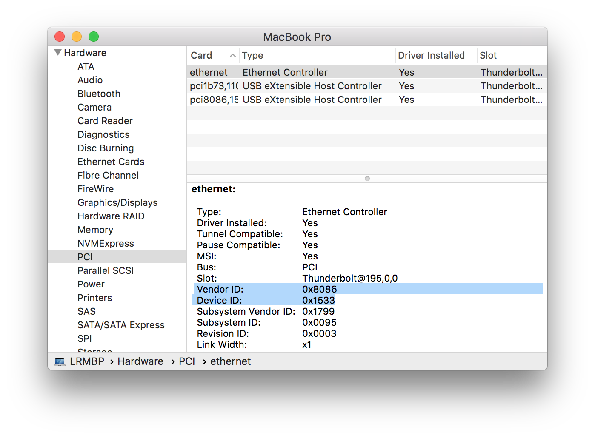

[](https://github.com/himbeles/mac-device-connect-daemon/actions?query=workflow%3A%22Compile+Handler%22)

# Automatically switch Yubikey serial number in GPG

Do you also use 2 Yubikeys with private key copies and are annoyed by this GPG dialogue: "Please insert card with serial number"? Then this little daemon could be right for you :).

This daemon will execute a small bash script, once your Yubikey is plugged in. The bash script will delete your private keys for your specified mail address on your macbook and restart GPG and SSH agents. This will get rid of this anoying "Please insert card with serial number" dialogue of GPG. 
The implementation is based on [himbeles mac-device-connect-daemon](https://github.com/himbeles/mac-device-connect-daemon) and on a [stack overflow post](https://security.stackexchange.com/questions/154702/gpg-encryption-subkey-on-multiple-smart-cards-issue).

## Put your shell script or executable into place

Adapt the `{{USER}}` and `{{MAIL}}` in shell script `switch-yubikey/switchyubikey.sh` to your needs and
make it executable:

```
chmod 700 switchyubikey.sh
```

Then move it into `/usr/local/bin`, or some other directory:

```
cp switchyubikey.sh /usr/local/bin/
```

## Building the stream handler

The stream handler is universal (no need to adapt) and can be built on a mac command line (with xcode installed):

```
gcc -framework Foundation -o xpc_set_event_stream_handler xpc_set_event_stream_handler.m
```

Let's place it into `/usr/local/bin`, like the main executable for the daemon.

```
cp xpc_set_event_stream_handler /usr/local/bin/
```

The stream handler is also compiled via a [Github Action](https://github.com/himbeles/mac-device-connect-daemon/actions?query=workflow%3A%22Compile+Handler%22) on every commit. 
This uses a Github `macos-latest` machine. 


## Setup the daemon

The plist file `com.switchyubikey.plist` contains the properties of the daemon that will run the executable on device connect trigger.

It contains information for identifying the device you want to base your trigger on, like `idVendor`, `idProduct`, `IOProviderClass`. These can be figured out in the `System Information` App on your mac.

Make sure that you use the right `idProduct` for your Yubikey. The id in this `com.switchyubikey.plist` is based on a Yubikey 5C NFC.



Convert the hex identifiers to integers before inserting into the plist file (for example using `int(0x8086)` in python).

`IOProviderClass` should be either `IOPCIDevice` (Thunderbolt) or `IOUSBDevice` (USB).

The other relevant entry in the plist file is the location of `xpc_set_event_stream_handler` and the executable.

Other entries include the location of standard output (log) files and the executing user.


Since this script does not require root privileges, we put `com.switchyubikey.plist` into `~/Library/LaunchAgents`:

```
cp com.switchyubikey.plist ~/Library/LaunchAgents/
```

## Launch the daemon

Activate the daemon:

```
launchctl load ~/Library/LaunchAgents/com.switchyubikey.plist
```

and you are good to go.


Unloading is done using `launchctl unload`.
